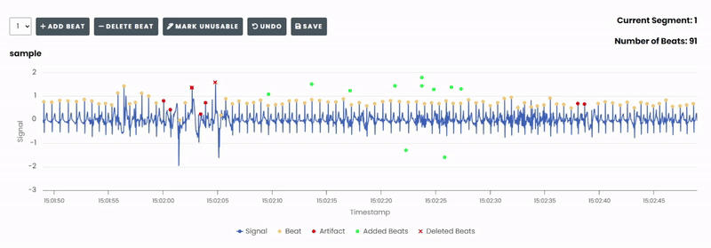
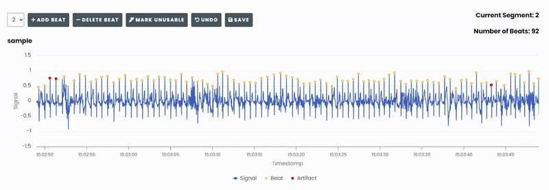
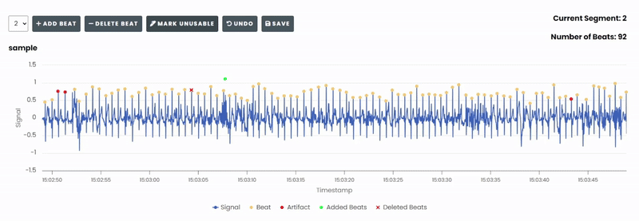
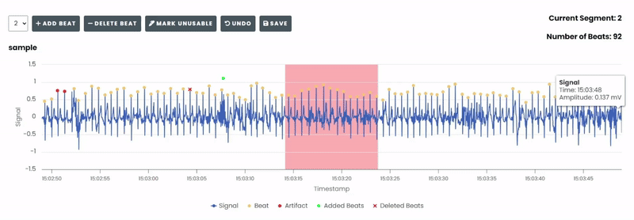
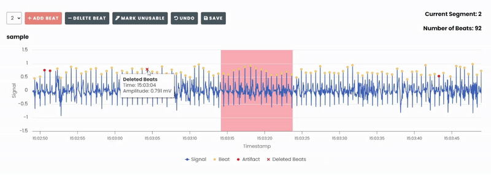
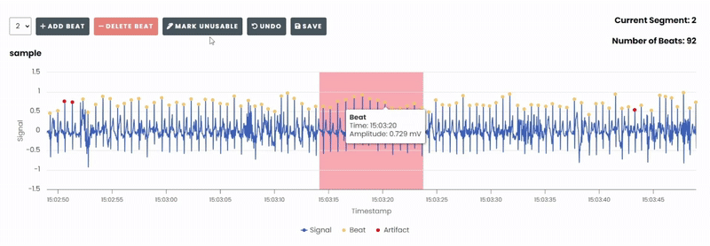
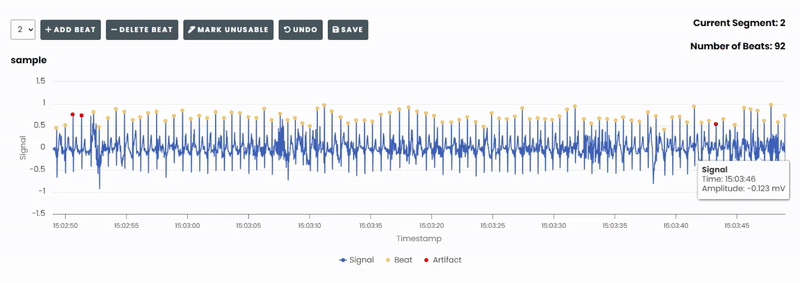
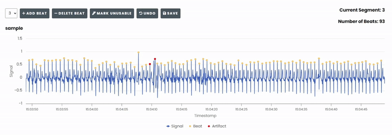
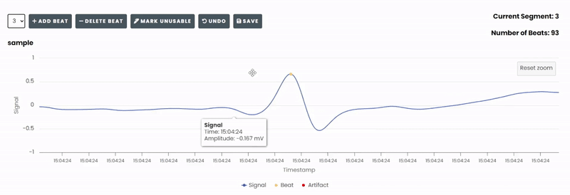

===========
Quick Guide
===========

A quick overview of the Beat Editor features and how to use them.

Add Beat
========
To add a new beat to the chart, click ``Add Beat`` and click on the desired position in the chart. 
A new beat will be created at that position.

Delete Beat
===========
To delete a beat from the chart, click ``Delete Beat`` and select the beat. The selected beat will be removed from the chart.

Mark Unusable
=============
To mark an area of the chart as unusable, click ``Mark Unusable`` and select the area.

Undo
====
To undo an action, the mode in which it was performed must be activated first.

Undo a beat insertion
---------------------
1. Click on ``Add Beat``.
2. Click ``Undo``.

Undo a beat deletion
--------------------
1. Click on ``Delete Beat``.
2. Click ``Undo``.

Undo an 'unusable' marking
--------------------------
1. Click on ``Mark Unusable``.
2. Click ``Undo``.

Save
====
To save changes, click the ``Save`` button after making edits. This will
save the current state of the chart to the server.

Zoom
====
To zoom in and out of the chart, use the ``Mouse Wheel`` or ``Drag-Select``.

Panning
=======
To pan over the chart, hold down the ``Shift Key`` and then click and drag with the mouse.

Keyboard Shortcuts
==================
The Beat Editor supports several keyboard shortcuts to enhance workflow:

- **A** - Add a new beat.
- **D** - Delete the selected beat.
- **U** - Mark the selected beat as unusable.
- **CTRL + Z** OR **⌘ + Z** (For Mac Users) - Undo the last action.
- **SHIFT + Left Mouse Click** - Pan over the chart.
- **Mouse Wheel** OR **Drag-Select** - Zoom in and out of the chart.
