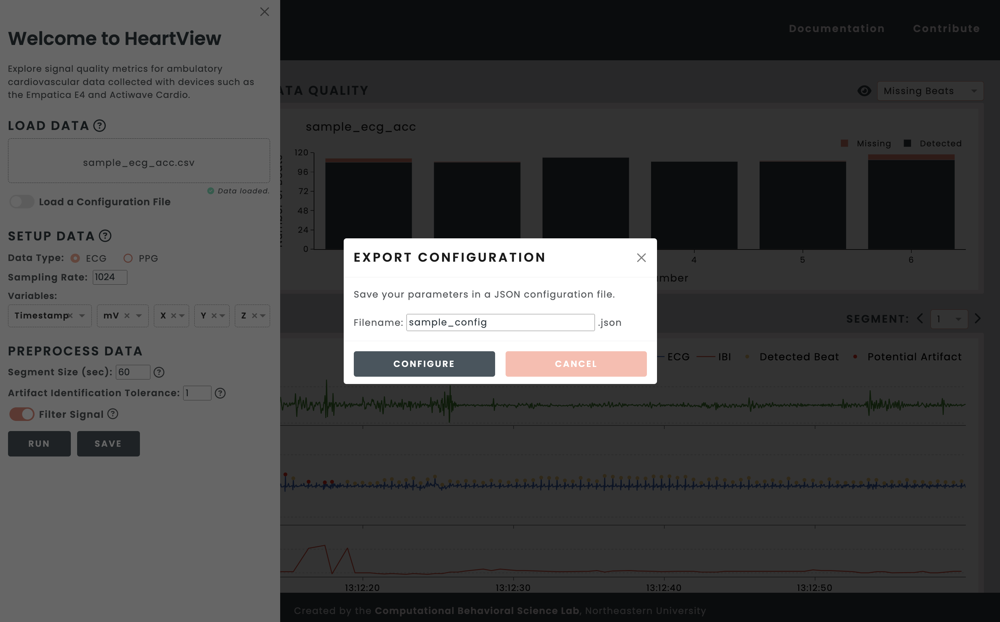
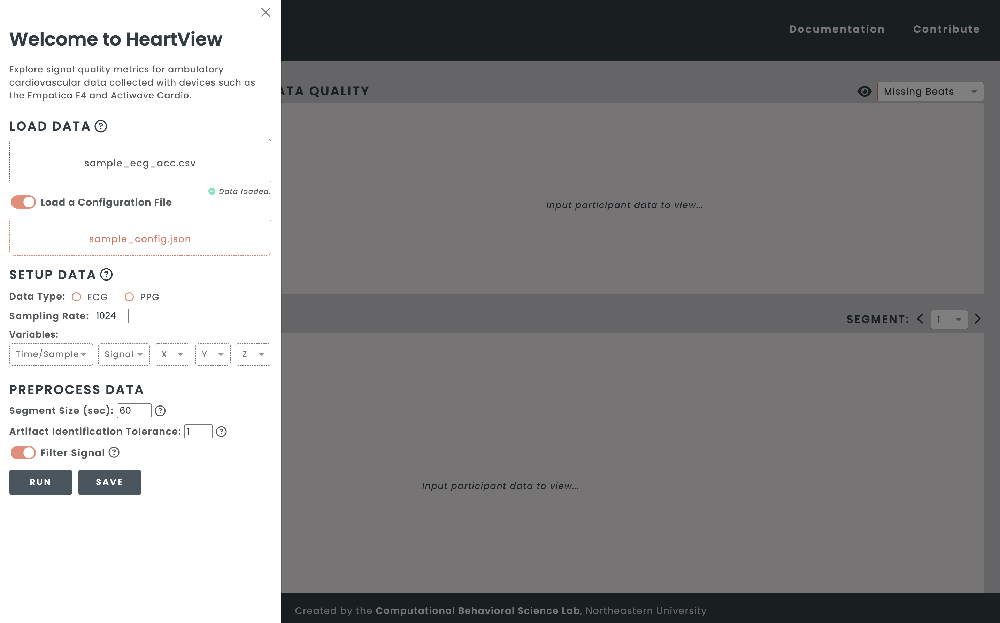

===================
Configuration Files
===================
The HeartView dashboard provides a flexible way to streamline your data
pre-processing workflow by using configuration files. These files allow you
to save your selected parameters, such as data types, sampling rates, and
filtering options, into a reusable format.

Saving Configuration Files
===========================

After setting your data pre-processing parameters in the welcome panel,
click the **Save** button to create a JSON configuration file for your
parameters.

Loading Configuration Files
===========================

Toggle the **Load a Configuration File** switch to display the configuration
file upload field. Click on *Select Configuration File...* to load your JSON
configuration file.

| |important| You must re-map any headers saved in your JSON configuration file to the dashboard variables.

.. |important| raw:: html

    Important: