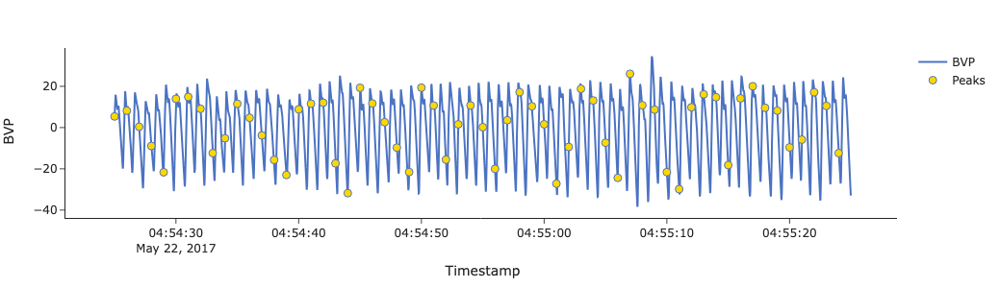

========
Examples
========

Below are examples of how you can use functions from the HeartView pipeline on
your data. Alternatively, see our |Jupyter notebooks| for full a full
walk-through for each type of data.

Reading and Pre-Processing Data
-------------------------------

|Actiwave Cardio|

Extract and pre-process data from an Actiwave Cardio device.

::

    from heartview.pipeline import ECG

    edf = 'sample_actiwave_data.edf'
    ecg, acc = ECG.read_actiwave(edf)

    display(ecg.head(), acc.head())

Output:

::

    	                 Timestamp	       mV
    0	2016-10-14 10:10:51.000000	-0.206620
    1	2016-10-14 10:10:51.000977	-0.197554
    2	2016-10-14 10:10:51.001953	-0.186148
    3	2016-10-14 10:10:51.002930	-0.197847
    4	2016-10-14 10:10:51.003906	-0.190243

|Empatica E4|

Extract and pre-process data from an Empatica E4 device. All pre-processed
data are stored in a Python dictionary.

::

    from heartview.pipeline import PPG

    e4_zip = 'sample_e4_data.zip'
    e4_data = PPG.preprocess_e4(e4_zip)

    e4_data.keys()

Output:

::

    dict_keys(['bvp', 'hr', 'ibi', 'acc', 'fs', 'start time'])

Beat Detection
--------------

|ECG|

Detect R peaks from ECG data collected with the Actiwave Cardio and other
sources. Note that ECG data from other sources will have to be read into a
Pandas data frame prior to this step.

::

    from heartview.pipeline import ECG

    # `ecg` = ECG DataFrame output from `ECG.read_actiwave()`
    # `'mV'` = name of column containing ECG values
    ecg_fs = 1024
    peak_loc = ECG.detect_rpeaks(ecg, 'mV', fs)

    # Save R peak occurrences
    ecg.loc[peak_loc, 'Peak'] = 1
    data.head()

::

    data['Peak'].sum()

Output:

::
    
    	Segment	                 Timestamp	       mV	Powerline	Filtered	Peak
    0	      1	2016-10-14 10:10:51.000000	-0.206620	-0.205123	-0.052997	NaN
    1	      1	2016-10-14 10:10:51.000977	-0.197554	-0.196108	-0.048060	NaN
    2	      1	2016-10-14 10:10:51.001953	-0.186148	-0.184952	-0.043212	NaN
    3	      1	2016-10-14 10:10:51.002930	-0.197847	-0.197073	-0.038543	NaN
    4	      1	2016-10-14 10:10:51.003906	-0.190243	-0.190011	-0.034127	NaN

::

    807.0

|Empatica E4|

Extract heartbeats from IBI data from the Empatica E4.

::

    from heartview.pipeline import PPG

    # `e4_data` = output from `PPG.preprocess_e4()`
    ibi = e4_data['ibi']
    e4_fs = e4_data['fs']
    start_time = e4_data['start time']

    e4_peaks = PPG.get_e4_peaks(ibi, e4_fs, start_time)
    e4_peaks.head()

::

    e4_peaks['Peak'].sum()

Output:

::

                Unix	                 Timestamp	Second	Peak	IBI	 HR
    0	1.495437e+09	2017-05-22 03:15:25.000000	   1.0	 NaN	NaN	NaN
    1	1.495437e+09	2017-05-22 03:15:25.015625	   1.0	 NaN	NaN	NaN
    2	1.495437e+09	2017-05-22 03:15:25.031250	   1.0	 NaN	NaN	NaN
    3	1.495437e+09	2017-05-22 03:15:25.046875	   1.0	 NaN	NaN	NaN
    4	1.495437e+09	2017-05-22 03:15:25.062500	   1.0	 NaN	NaN	NaN

::

    3457.0

Signal Quality Assessment
-------------------------

|ECG|

::

    from heartview.pipeline import ECG, SQA

    # Get second-by-second data
    ecg_fs = 1024
    seg_size = 60  # seconds
    interval_data = ECG.get_seconds(ecg, 'Peak', ecg_fs, seg_size)

    # Get the expected and detected numbers of peaks by segment
    peaks_by_seg = SQA.evaluate_peaks(interval_data, seg_size)

    # Compute the signal quality assessment metrics by segment
    sqa = SQA.compute_metrics(peaks_by_seg)
    sqa

Output:

::

    	Segment	                 Timestamp	Detected	  Expected	Invalid	    Missing	    % Missing
    0	      1	2016-10-14 10:10:51.000000	   131.0	133.408152	      0	   2.408152	     1.805101
    1	      2	2016-10-14 10:11:51.000000	   128.0	127.369862	      0	   0.000000	     0.000000
    2	      3	2016-10-14 10:12:51.000000	   128.0	129.086978	      0    1.086978	     0.842051
    3	      4	2016-10-14 10:13:51.000000	   130.0	128.334239	      0	   0.000000	     0.000000
    4	      5	2016-10-14 10:14:51.000000	   124.0	124.184217	      0	   0.184217	     0.148341
    5	      6	2016-10-14 10:15:51.000000	   137.0	137.181144	      0	   0.181144	     0.132047
    6	      7	2016-10-14 10:16:51.000000	    29.0	130.445860	      1	   101.445860	    77.76

|Empatica E4|

::

    from heartview.pipeline import PPG, SQA

    # Get second-by-second data
    seg_size = 60
    interval_data = PPG.get_e4_interval_data(e4_peaks, seg_size)
    
    # Get the expected and detected numbers of peaks by segment
    peaks_by_seg = SQA.evaluate_peaks(interval_data, seg_size)

    # Compute the signal quality assessment metrics by segment
    sqa = SQA.compute_metrics(peaks_by_seg)
    sqa

Output:
::

        Segment	              Timestamp	  Detected	    Expected	Invalid	    Missing	  % Missing
    0	      1	    2017-05-22 03:15:25	      24.0	   76.679121	      1	  52.679121	  68.700737
    1	      2	    2017-05-22 03:16:25	       0.0	         NaN	      1	   0.000000	   0.000000
    2	      3	    2017-05-22 03:17:25	      22.0	   83.200181	      1	  61.200181	  73.557750
    3	      4	    2017-05-22 03:18:25	     117.0	   77.311916	      0	   0.000000	   0.000000
    4	      5	    2017-05-22 03:19:25	      95.0	   75.786027	      0	   0.000000	   0.000000
    ...	...	...	...	...	...	...	...
    126	    127	    2017-05-22 05:21:25	      16.0	   63.997065	      1	47.997065	  74.998853
    127	    128	    2017-05-22 05:22:25	       0.0	         NaN	      1	0.000000	   0.000000
    128	    129	    2017-05-22 05:23:25	      75.0	   60.709631	      0	0.000000	   0.000000
    129	    130	    2017-05-22 05:24:25	      83.0	   61.932671	      0	0.000000	   0.000000
    130	    131	    2017-05-22 05:25:25	      62.0	   63.997065	      0	1.997065	   3.120557

Visualize Raw Data
-------------------------

|ECG|

::

    heartview.plot_signal(data, 'Timestamp', ['mV', 'Filtered'], fs, seg_size, segment = 1, signal_type = 'ecg', peaks='Peak')

Output:

|Empatica E4|

::

    fs = 64
    seg_size = 60
    bvp = heartview.segment_data(e4_data['bvp'], fs, seg_size)
    heartview.plot_signal(bvp, 'Timestamp', 'BVP', fs, seg_size, segment = 100, signal_type = 'bvp', peaks='Peak')

Output:

Visualize the expected-missing numbers of beats per segment.
------------------------------------------------------------

|ECG|

::

    SQA.plot_expected2missing(sqa, title = 'Sample ECG')

Output:

|Empatica E4|

::

    SQA.plot_expected2missing(sqa, title = 'Sample PPG')

Output:

.. |Jupyter notebooks| raw:: html

    <a href="https://github.com/cbslneu/heartview/tree/main/examples" target="_blank">Jupyter notebooks</a>

.. |Actiwave Cardio| raw:: html

    
Actiwave Cardio

.. |ECG| raw:: html

    
Actiwave Cardio and Other ECG Sources

.. |Empatica E4| raw:: html

    
Empatica E4
